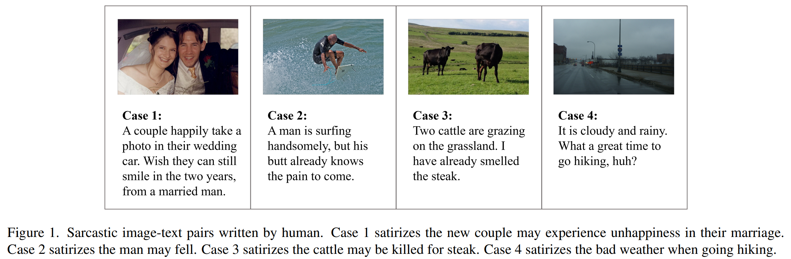

# CMSG-EGRM

This is the Repo for the paper: [Describe Images in a Boring Way: Towards Cross-Modal Sarcasm Generation](https://openaccess.thecvf.com/content/WACV2024/papers/Ruan_Describe_Images_in_a_Boring_Way_Towards_Cross-Modal_Sarcasm_Generation_WACV_2024_paper.pdf)


## Introduction
<div align=center>

</div>
Sarcasm generation has been investigated in previous
studies by considering it as a text-to-text generation problem, i.e., generating a sarcastic sentence for an input sentence. In this paper, we study a new problem of cross-modal
sarcasm generation (CMSG), i.e., generating a sarcastic description for a given image (Human written sarcastic image-text pairs are shown in Figure 1). CMSG is challenging as models need to satisfy the characteristics of sarcasm, as well
as the correlation between different modalities. In addition, there should be some inconsistency between the two
modalities, which requires imagination. Moreover, highquality training data is insufficient. To address these problems, we take a step toward generating sarcastic descriptions from images without paired training data and propose
an Extraction-Generation-Ranking based Modular method
(EGRM) for CMSG. Specifically, EGRM first extracts diverse information from an image at different levels and uses
the obtained image tags, sentimental descriptive caption,
and commonsense-based consequence to generate candidate sarcastic texts. Then, a comprehensive ranking algorithm, which considers image-text relation, sarcasticness,
and grammaticality, is proposed to select a final text from
the candidate texts. Human evaluation at five criteria on a
total of 2100 generated image-text pairs and auxiliary automatic evaluation show the superiority of our method

## Contribution
The main contributions are as follows: 

1) For the first
time, we formulate the problem of cross-modal sarcasm
generation and analyze its challenges.

2) We propose a nontrivial extraction-generation-ranking based modular method
(EGRM) to address the challenging CMSG task. EGRM
uses commonsense-based consequence and image tags to
generate imaginative sarcastic texts, which makes the two
modalities relevant and inconsistent to produce sarcasm.
Moreover, we consider the performance of candidate sarcastic texts from multiple perspectives, including imagetext relation, semantic inconsistency, and grammar, and propose a comprehensive ranking method that simultaneously
considers the performance of candidate texts from multiple perspectives to select the best-generated text. EGRM
doesn’t rely on cross-modal sarcasm training data.

3) Human evaluation results show the superiority of EGRM in
terms of sarcasticness, humor, and overall performance.


# Citation
Please cite our work if you find it useful.
```
@inproceedings{ruan2024describe,
  title={Describe Images in a Boring Way: Towards Cross-Modal Sarcasm Generation},
  author={Ruan, Jie and Wu, Yue and Wan, Xiaojun and Zhu, Yuesheng},
  booktitle={Proceedings of the IEEE/CVF Winter Conference on Applications of Computer Vision},
  pages={5701--5710},
  year={2024}
}
```
```
@article{ruan2022describe,
  title={How to describe images in a more funny way? towards a modular approach to cross-modal sarcasm generation},
  author={Ruan, Jie and Wu, Yue and Wan, Xiaojun and Zhu, Yuesheng},
  journal={arXiv preprint arXiv:2211.10992},
  year={2022}
}
```
